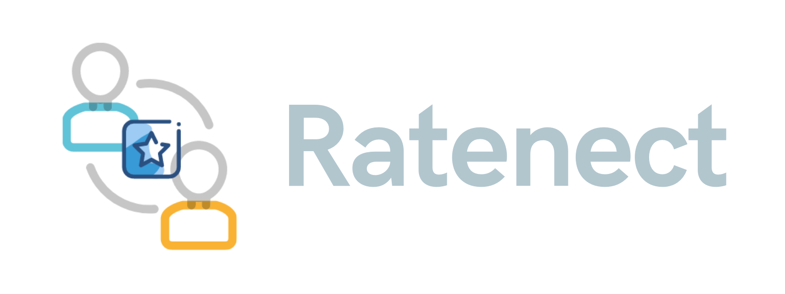

# Ratenect

  
Ratenect is a web platfrom with a two-way rating system where the users can find NGOs near them and can apply to volunteer in-person for their public activities. Based on their experience the NGOs can rate the volunteers and vice-versa.
  
Read more details about the project inspiration [here](https://cbrtl.github.io/posts/ratenect/).

## Tech Stack

- **Frontend**: React
- **Backend**: Node js, Express js
- **Database**: MongoDB (Atlas)

## Plan

- **UI**: [Figma](https://www.figma.com/file/W7mgBV73gMNZRFjuEewyDN/ratenect?node-id=0%3A1)
- **Database Schema**: [dbdiagram](https://dbdiagram.io/d/60e010ba0b1d8a6d39650956)

## Run Project

- Clone the repository
- `cd` into the `ratenect-frontend` folder
- switch to dev branch `git checkout dev`
- run `npm install`
- then you can start working on the issue given
- save the changes and run `npm start`
- visit http://localhost:3000/ in your browser, to check your changes.

## Contributing:

1.  Go through the [Contributing Guidelines](https://github.com/cbrtl/ratenect-backend/blob/dev/CONTRIBUTING.md).
2.  Fork this repository and then clone the forked repository to your system.
3.  Create a new branch `<your-github-username>`.
4.  Switch to your new branch and add your github username to the `contributors.md` file.
5.  Commit the changes in your local system and `git push` to the upstream.
6.  Come back to ratenect's github page and make a [Pull Request](https://docs.github.com/en/github/collaborating-with-pull-requests/proposing-changes-to-your-work-with-pull-requests/creating-a-pull-request) from `you:<your-branch>` to `cbrtl:dev`.
